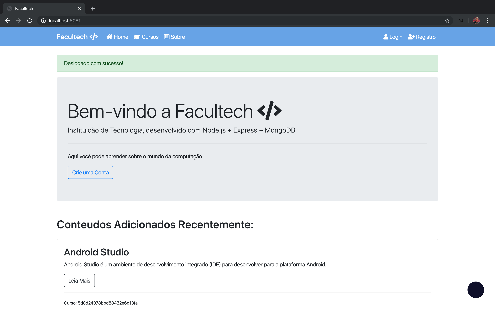
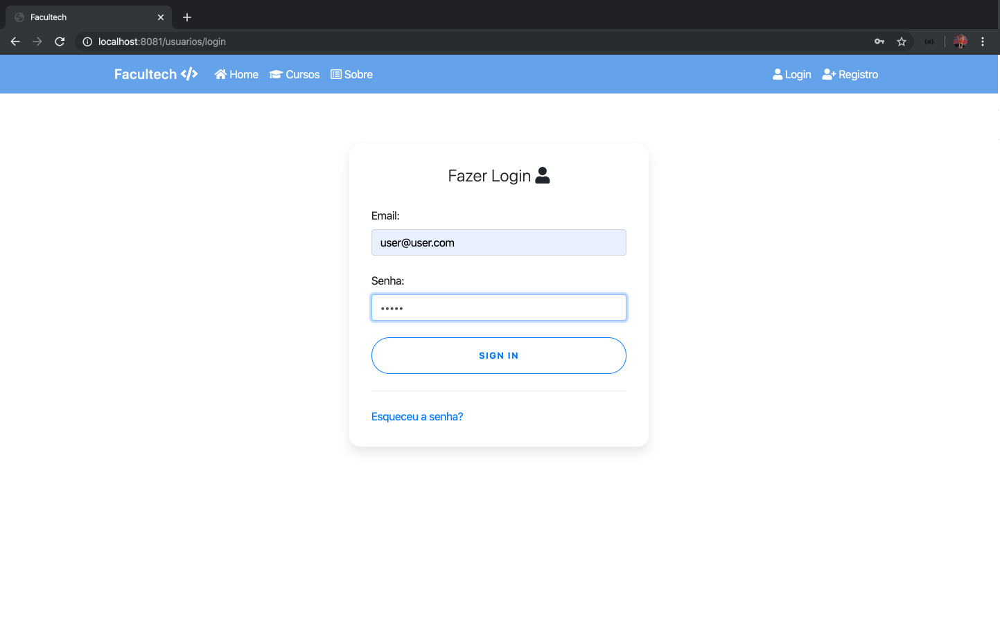
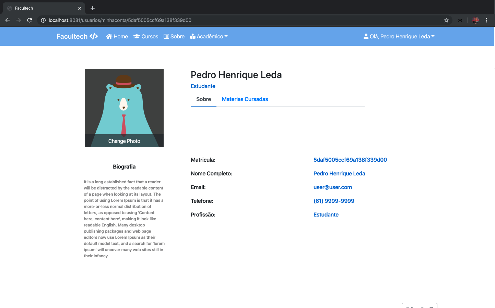
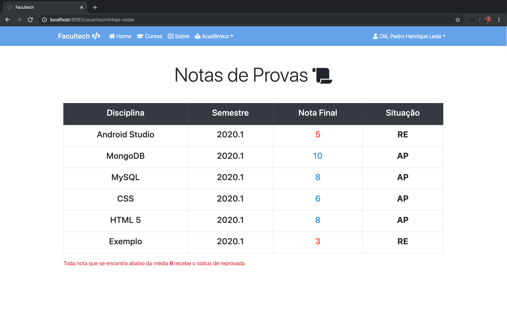
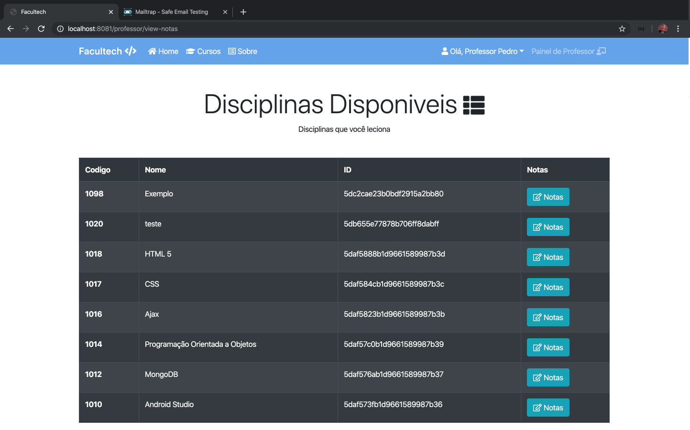
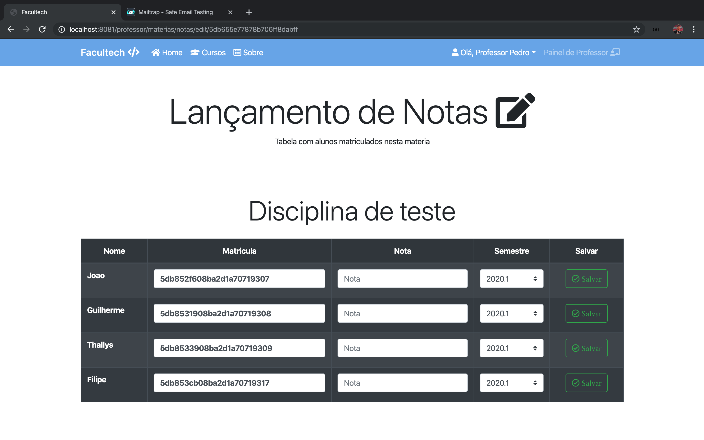

# Facultech

## Prototipo de sistema de faculdade

Tecnologias usadas: https://prezi.com/view/fLE1fipUS6ePe7r8GvEm/

### Funções presentes no Prototipo:

- Cadastrar Usuario(normal user, Professor ou Administrador).
- altenticação e criptografia das senhas dos usuarios.
- Login para diferenciar os Usuarios (Cada Usuario tem acesso a rotas especificas da aplicação).
- Se pode criar, editar e deletar Cursos.
- Se pode criar, editar e deletar Materias criadas dentro dos Cursos.
- Listagem de cursos e listagem de materias.
- Realizar Matricula de alunos dentro das materias.
- Lançamento e consulta de notas.

## Requisitos do projeto

<p align="justify">Para executar a aplicação, deve ter os seguintes softwares instalados:</p>

<ul>

<li>YARN ou NPM instalados </li>

```bash
Yarn na versão 1.17.3 ou mais recente.
               ou
NPM na versão 6.12.0 ou mais recente.
```

<li>MongoDB instalado</li>

```bash
Sugestão: Tenha o MongoDB Compass instalado, pois ajuda a gerenciar o banco de dados.
```

<li>Git instalado (para clonar o repositorio)</li>

```bash
Git na versão 2.23.0 ou mais atual.
```

</ul>

## Para executar o projeto

1. Clone o repositório com o comando, via terminal:

```bash
git clone: https://github.com/pedrinholeda/sistema-faculdade.git
```

2. Verifique a disponibilidade de host:

```bash
Verifique se a porta localhost 8081 não esta sendo usada.
```

3. Pelo terminal, entre na pasta raiz do projeto

4. Execute o seguinte comando para baixar todos os pacotes e dependências :

```bash
yarn install
    ou
npm install
```

5. Em seguida, execute o seguinte comando:

```bash
yarn dev
   ou
npm run dev
```

## Como criar um usuario com privilegios de Administrador:

- Entre no arquivo "usuarios.js" dentro da pasta de rotas "routes".
- Procure a constante novoUsuario.

```
 const novoUsuario = new Usuario({
      nome: req.body.nome,
      email: req.body.email,
      senha: req.body.senha
          });
```

- Apos encontrar, altere a constante adicionando o eAdmin e atribua a ele o valor 1 :

```
 const novoUsuario = new Usuario({
      nome: req.body.nome,
      email: req.body.email,
      senha: req.body.senha,
      eAdmin: 1
          });
```

- Feito isso salve o codigo, suba o servidor e cadastre o usuario, cadastrado o usuario no banco de dados ele vira com privilegios de administrador, após cadastrar retorne a constante novoUsuario para forma antiga (sem o eAdmin) e suba o servidor novamente.

- Apos criar um usuario com privilegios de administrador, a opção de gerenciar sera liberada na NavBar, lá e possivel criar um novo usuario administrador por meio do front-end.

# Capturas de Tela da Aplicação

## Tela inicial.



## Tela de Login.



## Tela de Perfil.



## Tela de quadro de notas do Usuario.



## Tela de quadro de materias (Professor).



## ela de Lançamento de notas (Professor)



-status Finalizado.
